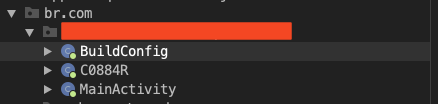
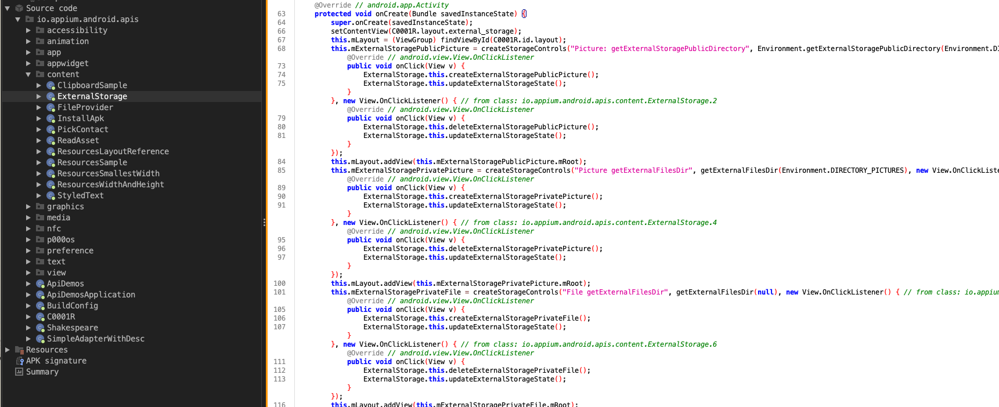

## Summary

1. Introduction
2. Less talk, show me the code!
3. SSL Pinning for you, not for me!
4. Intercept, intercept and intercept
5. References

<br>

### Introduction
Continuing with my mobile pentest studies—and, of course, doing mobile pentests at work—it's pretty common to run into different mobile apps built with various programming languages. For example, you’ll find apps developed in Java, Kotlin, Flutter, Xamarin, Swift… and a bunch of others.

So far, I’ve only worked with Java and Flutter apps, but I’m looking forward to exploring others. What am I getting at here? Basically, what's the difference between decompiling a Java app and a Flutter app? Simple: you can't just open Flutter apps in JADX and call it a day :(

You'll probably find only a few class files that won’t be nearly as helpful as you'd hope. For example, here’s the app I’m currently wrestling with:



As you can see, we only have a `MainActivity` file, a class file with a random name, and the `BuildConfig` file (don’t forget to check the BuildConfig file—you might find something useful there). When I see this, two scenarios come to mind:
1. The rest of the app is obfuscated.
2. The app is built with Flutter.

I went with the second option. Why? Because it's pretty easy to identify a Flutter app just by looking at the extracted content from the APK file (I used apktool for this) and checking the lib directory.


For now, we're most interested in these two files: `libflutter.so` and `libapp.so`. For those who don’t know, Flutter is a software development kit created by Google, commonly used to develop applications for Android, iOS, Linux, macOS, and other platforms. However, it’s primarily popular for mobile apps.

The `libflutter.so` file contains the Flutter engine, mainly developed in C++. One of its key components is Skia (a 2D graphics library), which renders the UI and displays it in the `FlutterView`, also known as the *Raster Thread*. There’s also the *Platform Thread*, which interacts with the native APIs of Android and iOS. Finally, we have the *UI Thread*, responsible for executing Dart code and managing widgets.

On the other hand, `libapp.so` is unique to each Flutter application. It contains the compiled Dart project—essentially, the mobile app’s source code. This code is compiled into native machine code using AOT (Ahead-of-Time) compilation, meaning the code is translated into machine instructions before the app actually runs, typically during the production build.

As stated in the Dart documentation, AOT-compiled code guarantees better performance during application execution, such as a fast startup and consistent runtime performance, unlike JIT-compiled code, which is slower at startup but can reach better performance after some time when necessary runtime optimizations occur. Naturally, during a fast development cycle, the Dart VM offers developers JIT compilation features like hot reload, live metrics collection, and debugging support, which help a lot in thoroughly testing the application.


> https://medium.com/flutter/flutter-dont-fear-the-garbage-collector-d69b3ff1ca30

When apps are finally ready to be deployed to web applications or app stores, you can compile your application with the Dart AOT compiler to native ARM or x64 machine code, which, as discussed earlier, will offer better startup performance for your entire application. The AOT-compiled code will run inside the Dart runtime environment with a memory management system that employs fast garbage collection and a generational garbage collector.

In the final process, the `libflutter.so` file launches the Flutter engine and sets up the environment, while the `libapp.so` file is loaded by the Flutter engine. This allows the Dart code to run within the Flutter engine, powered by `libflutter.so`.


> Flutter Architectural Overview - Flutter

<br>

### Less talk, show me the code!
To provide more context, if we open a generic Java application in decompilation tools like [JADX](https://github.com/skylot/jadx) and the app does not use any obfuscation solution, the reverse-engineering process becomes extremely easy since the code is human-readable. For example, I downloaded a specific application from the Play Store and decompiled the APK file using JADX. By following the package name in the Source Code tab and accessing the Java files, you can see that everything is much easier to understand.



Getting Flutter's apps source code isn’t exactly trivial. You could open the `libapp.so` file in Ghidra, IDA, BinaryNinja, or whatever tool you prefer, and try your best to figure out what's going on. But honestly, I prefer a different approach. It’s not a secret method, just a more efficient one (at least in my opinion).

Thankfully, [Worawit](https://github.com/worawit), along with six other contributors, created the [Blutter](https://github.com/worawit/blutter) project. Blutter is a Flutter reverse-engineering tool that supports arm64 and allows lazy people like us to extract more readable code and structure from a Flutter app. It’s super simple to use, though you'll need some libraries and dependencies set up. In my case (MacOS), I had to install `cmake`, `ninja`, `pkg-config`, `icu4c`, `llvm`, and a few others. BUT! For actually running Blutter, all you need is a Python script.

As the Blutter README explains, you just need to run the Python script, specify the path to the `arm64-v8a` directory, and set an output directory:

```css
python3 blutter.py path/to/app/lib/arm64-v8a out_dir
```

After that, Blutter compiles the necessary libraries and extracts some resources to execute the reverse-engineering process. Hopefully, after a few minutes, your output will look similar to mine. If any errors occur during this process or your PC crashes, make sure to read the stack trace carefully and check the Blutter GitHub repository's Issues tab for similar problems. For added context, I'm running this on a MacBook, I haven't tried Blutter on any other OS yet.


If we navigate to our previously created output directory (in this case, I named it **decompiled_code**) and access the files, we now see a bunch of directories. It contains all the libraries used by the app and the app itself. If you look further, you can find your targeted directory based on the application package name.


The blurred directories are our target. From here, you can either dig through the countless files Blutter extracted or, like me, open the directory in VSCode for a more user-friendly overview. You're probably going to see a structure similar to the image below. Now it's 10 times easier to understand the application architecture and focus on the most important parts of the code.


Now we have a much better environment for reverse engineering the mobile application and searching for vulnerabilities. I highly recommend using [gitleaks](https://github.com/gitleaks/gitleaks) or any secret-finding tool (TruffleHog, Semgrep) to identify low-hanging fruits. I did this and found some interesting results, but that's not the focus of this article, so we will skip that part.

<br>

### SSL Pinning for you, not for me!
**SSL Pinning** (or **Certificate Pinning**) is a technique that helps developers secure their mobile apps from Man-in-the-Middle (MITM) attacks. It ensures that the app only trusts specific certificates instead of the entire certificate chain. Instead of trusting any valid certificate chain, the application stores a copy of the server's certificate or public key and verifies if the connection uses that exact certificate.

In the context of SSL Pinning, there are different pinning approaches. For example, we have **Public Key Pinning**, which is a mechanism for sites to specify which certificate authorities have issued valid certificates for that specific site, and to reject TLS connections to those sites if the used certificate is not issued by a known-good CA. The idea is also to prevent man-in-the-middle attacks by hard-coding the public key of the server's SSL certificate instead of the entire certificate. In this way, the client will check if the server certificate contains the same public key that is hard-coded in the application code. The main advantage of Public Key Pinning is that even if the server certificate changes, the client will still trust the server if the public key remains the same, although it is harder to implement.

Another method is **SPKI Pinning**. The Subject Public Key Info (SPKI) is basically the key with a bit more salt, it can include the algorithm used for encoding or other parameters. SPKI is obtained from the **Certificate Signing Request (CSR)**, which collects the necessary information from a pair of public and private keys. The use of SPKI Pinning is not very convenient because you will need to release a mandatory update of your app when the certificate gets renewed, which will probably make things harder to maintain. It is possible to "bypass" this problem if you keep the same Certificate Signing Request (CSR) on every renewal process, but that violates the key rotation principle, which is the process of replacing old encryption keys with new ones to reduce the risk of compromised keys.


While analyzing the source code extracted by Blutter, I found something interesting that caught my attention. In the project files, there was a file called `dio_http_service_imp.dart`. [Dio](https://pub.dev/packages/dio) is a popular HTTP networking package for Dart/Flutter, supporting TLS connections. From the official Dio documentation, this is the basic implementation:

```javascript
void initAdapter() {
  const String fingerprint = 'ee5ce1dfa7a53657c545c62b65802e4272878dabd65c0aadcf85783ebb0b4d5c';
  dio.httpClientAdapter = IOHttpClientAdapter(
    createHttpClient: () {
      final HttpClient client = HttpClient(context: SecurityContext(withTrustedRoots: false));
      client.badCertificateCallback = (cert, host, port) => true;
      return client;
    },
    validateCertificate: (cert, host, port) {
      if (cert == null) return false;
      return fingerprint == sha256.convert(cert.der).toString();
    },
  );
}
```

As we can see above, we start by defining a variable called **fingerprint** that will contain the SHA256 hash of the public certificate key. After that, we create the HttpClient, ensuring that the SecurityContext is set with **withTrustedRoots** set to false so that we don't trust any certificate just because its root cert is trusted. Furthermore, we check if the certificate fingerprint matches the SHA256 hash and ensure that at least one certificate is being supplied.

It works perfectly for servers that have a self-signed certificate, however, it will not work for external certificates issued by AWS, Let's Encrypt, or other third parties. Therefore, we can verify the root of the HTTPS certificate that is provided by the server. The code below is an example of using a static PEM certificate and SecurityContext. It also supports PKCS#12 certificates, but PKCS#12 certificates require a password to be used, which exposes the password in the code; hence, the project does not recommend using them in common cases.

```javascript
void initAdapter() {
  String PEM = 'XXXXX'; // Root certificate content
  dio.httpClientAdapter = IOHttpClientAdapter(
    onHttpClientCreate: (_) {
      final SecurityContext sc = SecurityContext();
      sc.setTrustedCertificates(File(pathToTheCertificate));
      final HttpClient client = HttpClient(context: sc);
      return client;
    },
  );
}
```

The most interesting part is this line `sc.setTrustedCertificates(File(pathToTheCertificate));` This indicates that the app expects a static certificate file. After reading [this article by Mohamed Malkia](https://medium.com/@melkia.med.taki/how-to-use-tls-ssl-in-flutter-with-dio-15eda4f80baf), I immediately searched the source code for **.pem** and **.key** extensions. And guess what? I found actual references to these files:


Going back to VSCode and using the search function, I typed `.pem` in the "Search" field and immediately got two references in the code, again in the `dio_http_service_imp.dart` file. Acessing these files we can get more details about the usage of the Dio package.


The app reads the certificate bytes and implements them using Dart's SecurityContext methods **useCertificateChainBytes** and **usePrivateKeyBytes**. According to the documentation:
- useCertificateChainBytes: Sets the chain of X.509 certificates served by the SecureServerSocket during secure connections, including the server certificate.
- usePrivateKeyBytes: Sets the private key for the corresponding certificate.


Interestingly, the application doesn't use standard ports like 443, 80, or 8080. Instead, the API is hosted on port **444**. This is crucial for properly configuring our proxy because if we try intercepting ports 443, 80, or 8080, we would probably only capture requests from third-party sources rather than those from the targeted application. Therefore, make sure to identify where the application is actually consuming data so that no important requests are missed.


It is important to note that every Certificate Pinning mechanism can be bypassed if the attacker has the necessary time and patience. The main idea of these mechanisms is to offer more security to users, reducing risk and making attackers' lives harder, but it will always be a cat-and-mouse game until vendors like Google and Apple develop technology to mitigate this problem (and I’m not even sure if that’s possible).

<br>

### Intercept, intercept and intercept

After all this analysis, we're ready to intercept the traffic. Here's what we need to do:

1. Create IPTables rules to redirect the traffic.
2. Configure the proxy on our Android device (I'm using an emulated Pixel 9 Pro).
3. Set up Burp Suite.
4. Use the NVISO disable-flutter-tls script.

Starting with IPTables, IPTables is a utility program from Linux that helps users configure network rules. In our case, it's a really simple process—we just need to redirect the incoming traffic from port 444 to port 8080, where our Burp Suite proxy is running. The command I used for this is:

```java
emu64a:/ iptables -t nat -A OUTPUT -p tcp --dport 444 -j DNAT --to-destination <local-ip>:8080
emu64a:/ iptables -t nat -A POSTROUTING -p tcp -d <local-ip> --dport 8080 -j MASQUERADE
```

After that, we need to go to our Wi-Fi settings on our Android device and change the proxy setting from “None” to “Manual,” specifying the host and port we want. In this case, the host will be your local IP and the port will be the same as the Burp Suite proxy. This will allow our emulated device to communicate with our Burp Suite proxy client.


Now, for Burp Suite, we need to take the PEM and KEY files that are statically stored in the assets directory from the decompiled mobile app and generate a PKCS#12 file to later import into Burp Suite TLS settings. Why PKCS#12? Because Burp Suite TLS currently only supports PEM certificates.

```bash
openssl pkcs12 -export -out file.p12 -inkey key_file.key -in pem_file.pem -certifile pem_file.pem
```

Here, the flags `-export` and `-out` specify that we want to write the certificate's content to an output file. The `-inkey` flag specifies the private key from the certificate, combined with the `-in` and `-certifile` flags to indicate to OpenSSL which files are our certificates—we can repeat the PEM certificate file here.


Now, go to your Burp Suite settings, navigate to the Network tab, and click on the “TLS” section. Scroll down to “Client TLS Certificates” and click the “Add” button to add a new certificate.

In the “Destination host” input, enter the host address from the API or website whose traffic you want to intercept (you don't need to specify the port), and be sure to click the “File (PKCS#12)” radio button because you need to import your PKCS#12 file. After that, click the “Next” button.


Next, click the “Select file” button and locate the .p12 file you generated using the OpenSSL command. During the process of generating the file with OpenSSL, you will be prompted to set a password; you must enter the same password in the “Password” field below the “Certificate file” field.


If everything goes well, your file will be loaded and you can even see some information about the imported certificate.


Now for the final steps with Burp Suite, go to the Proxy settings and make sure the “Bind to port” is the same from the IPTables and change the “Bind to address” from “Specific addres” to “All interfaces” making sure we actually can intercept the traffic. After that, go the “Request handling” tab and check the “Support invisible proxying” checkbox.


To finish, download the NVISOsecurity Frida script to disable Flutter’s TLS verification, [you can find it here](https://github.com/NVISOsecurity/disable-flutter-tls-verification). This script uses pattern matching to find **ssl_verify_peer_cert** in the **handshake.cc** file. The **handshake.cc** file is part of the [BoringSSL project](https://github.com/google/boringssl/), a fork of OpenSSL used by Chrome/Chromium and Android. To execute the script, ensure that the Frida server is running on your Android device (it can be done via ADB) and run the following command:

```bash
frida -U -f your.package.name -l disable-flutter-tls.js --no-pause
```

Don't forget that you need to have the Burp Suite certificate installed on your device. There are various methods to do this, so I won't cover that process here; however, you can find plenty of resources online that explain how to do it.


Frida will run the app for us, so we go to Burp Suite and “HTTP History” tab we can see that now we can successfully intercept the app HTTP/HTTPS traffic.


<br>

## References
- [https://docs.flutter.dev/](https://docs.flutter.dev/)
- [https://dart.dev/overview](https://dart.dev/overview)
- [https://onuoha.medium.com/how-does-jit-and-aot-work-in-dart-cab2f31d9cb5](https://onuoha.medium.com/how-does-jit-and-aot-work-in-dart-cab2f31d9cb5)
- [https://github.com/worawit/blutter](https://github.com/worawit/blutter)
- [https://wiki.mozilla.org/SecurityEngineering/Public_Key_Pinning](https://wiki.mozilla.org/SecurityEngineering/Public_Key_Pinning)
- [https://oleksandr-stepanov.medium.com/ssl-pinning-how-to-make-it-right-ecc5c9844215](https://oleksandr-stepanov.medium.com/ssl-pinning-how-to-make-it-right-ecc5c9844215)
- [https://owasp.org/www-community/controls/Certificate_and_Public_Key_Pinning](https://owasp.org/www-community/controls/Certificate_and_Public_Key_Pinning)
- [https://medium.com/@melkia.med.taki/how-to-use-tls-ssl-in-flutter-with-dio-15eda4f80baf](https://medium.com/@melkia.med.taki/how-to-use-tls-ssl-in-flutter-with-dio-15eda4f80baf)
- [https://api.flutter.dev/flutter/dart-io/SecurityContext/usePrivateKeyBytes.html](https://api.flutter.dev/flutter/dart-io/SecurityContext/usePrivateKeyBytes.html)
- [https://api.flutter.dev/flutter/dart-io/SecurityContext/useCertificateChainBytes.html](https://api.flutter.dev/flutter/dart-io/SecurityContext/useCertificateChainBytes.html)
- [https://github.com/NVISOsecurity/disable-flutter-tls-verification](https://github.com/NVISOsecurity/disable-flutter-tls-verification)