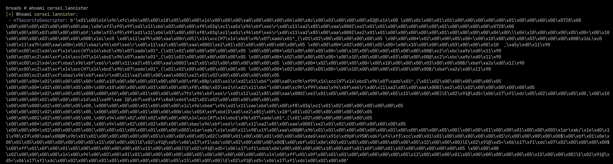
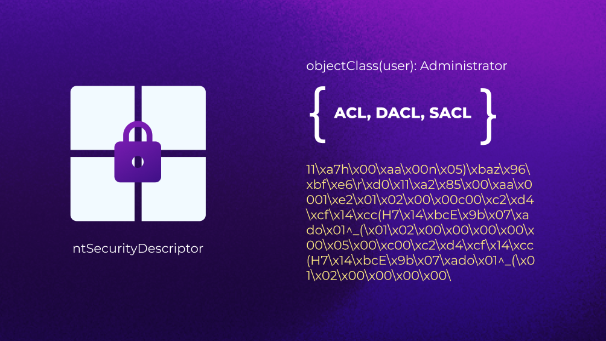
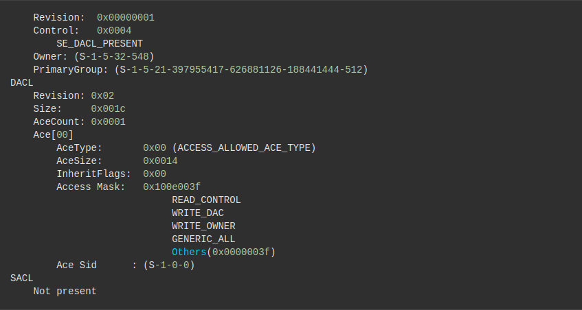
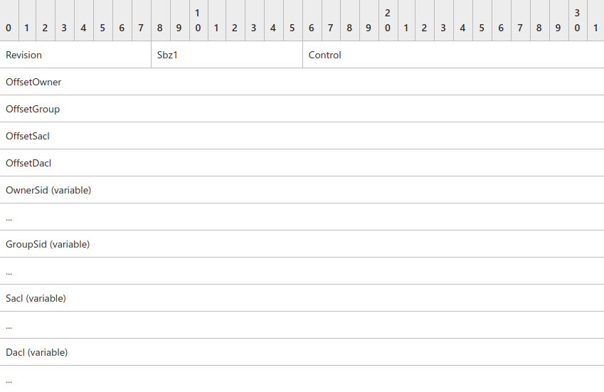
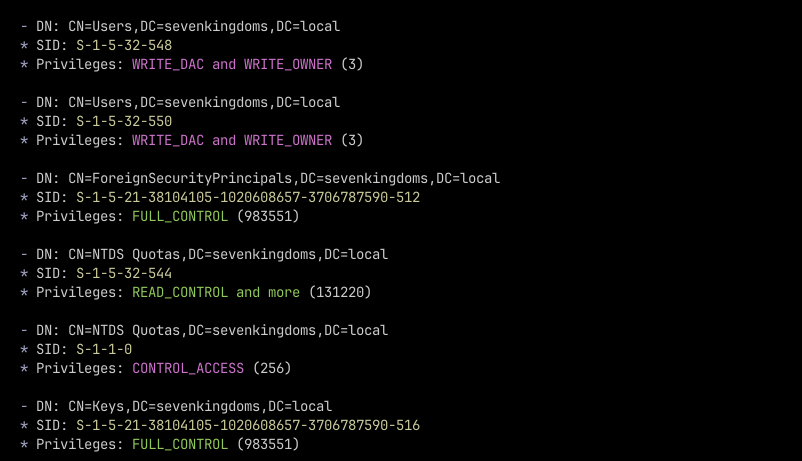

## O que é?
O Security Descriptor ou ntSecurityDescriptor, é um atributo de segurança do Windows que contém uma estrutura de dados representativa das permissões e propriedades daquele objeto em questão. Podemos interpretar o mesmo como uma ideia do escopo de permissões do X sobre Y. O ntSecurityDescriptor está presente desde as versões superiores do Windows Server 2000 e se manteve o mesmo desde então.

O Security Descriptor é um representação compactada binária da segurança associada a objeto pertecente ao ambiente. Para comprovação disso, podemos tentar extrair o Security Descriptor de um usuário ou grupo por meio de uma query LDAP e vermos seu formato puro.



É importante salientar que o ntSecurityDescriptor é utilizado por DACLs, SACLs, e ACL. Esses três atributos são responsáveis por representar as permissões desse objeto consumindo os dados do ntSecurityDescriptor. Essas permissões são de quem representa aquele objeto, quem pode acessar esse objeto e o que pode fazer com o mesmo, informações de auditoria do objeto e restrições sobre tal.

- **ACL**: *Access Control List* é uma lista de proteções de seguranças que são aplicadas sobre um objeto. Deve-se entender que objetos podem ser um arquivo, processo, evento, ou tudo aquilo que também tiver um “Security Descriptor”;
- **ACE**: *Access Control Entries* são entrada de dados de ACLs (Access Control List). Uma ACE contém uma lista de permissões sobre um SID que irá identificar se tais permissões participam dos escopos: Allowed, Denied ou Audited;
- **DACL**: *Discretionary Access Control List* é o responsável por identificar os administradores ou objetos que tem permissões ou não sobre objetos protegidos. Caso um processo tente interagir com um objeto protegido, o sistema irá requisitar ao que ACE busque na DACL se aquele autor em questão tem as permissões necessárias;
- **SACL**: *System Access Control List* é uma lista que permite que adminstradores registrem tentativas de interação ou acesso a um objeto protegido. Cada ACE irá especificar as tentativas de acesso sobre aquele item e fará com que o sistema armazene essa tentativa no Security Event Log;



De acordo com a Microsoft, o ntSecurityDescriptor utiliza de um sistema chamado *Security Descriptor String Format*. O *Security Descriptor String Format* é um formato ou sistema de texto responsável por armazenar ou transportar a informação do ntSecurityDescriptor. Isso é feito por duas funções chamadas **ConvertSecurityDescriptorToStringSecurityDescriptorA** e **ConvertStringSecurityDescriptorToSecurityDescriptorA**. Essas duas funções são utilizadas para o trabalho de conversão dos Security Descriptor.

É possível transformar um *“String Security Descriptor*“ para um *Security Descriptor Absoluto* através de outra função que é chamada de **MakeAbsoluteSD**. Essas três funções iram retornar valores não nulos, caso todos os argumentos necessários forem repassados e serem válidos. Com o seu retorno, é possível extrair o formato do Security Descriptor.

Para que as funções citadas acima possam descrever o formato do Security Descriptor, é utilizado a tecnologia SDDL (Security Descriptor Definition Language) que irá fazer essa tradução e permitir que as funções possam representar elas em texto. Aqui estão alguns exemplos de SDDL retirados do artigo da Microsoft:

### Exemplos

**Regra**: Qualquer usuário poderá executar esse objeto se ele seguir as seguintes condições:
1. O título dele ser PM
2. A divisão ou setor dele for Financeiro ou Vendas
````
d:(XA; ;FX;;;S-1-1-0; (@User.Title=="PM" && (@User.Division=="Financeiro" || @User.Division =="Vendas")))
````

**Regra 2**: Permite leitura do objeto se o usuário seguir as seguintes condições:
1. Seu login ter sido feito a partir de um Smart Card
2. É pertencente do grupo Backup Operator
3. Está conectado em uma máquina com o BitLocker ativo
````
D:(XA; ;FR;;;S-1-1-0; (Member_of {SID(Smartcard_SID), SID(BO)} &&@Device.Bitlocker))
````

## Qual a sua importância?
Através do Security Descriptor, pode-se compreender qual o escopo de privilégios que aquele ativo terá sobre um item de seu interesse ou que haverá uma possível interação. Com isso em mente, a Microsoft desenvolveu esse atributo expressivo para que fosse alocado sobre os objetos do ambiente Active Directory e pudesse trabalhar as questões de controle de acesso. Atualmente, ele é utilizado por outras classes do ambiente Active Directory como:

- samDomainBase: A classe base para a definição de domínios;
- securityPrincipal: Armazena informações de segura sobre um objeto;
- top: A classe de mais alto nível que é de onde todas as classes derivam;

Hoje em dia, ferramentas como o **BloodHound** usufruem de ACEs e DACLs para identificar as permissões que um objeto tem sobre o outro, e assim, poder construir caminhos de exploração por meio de fragilidades do objeto X sobre o objeto Y.

## Trabalhando com o ntSecurityDescriptor
O ntSecurityDescriptor segue o seguinte formato `O:BAG:BAD:S:`, onde:

- O: Owner
- BAG e BAD serão utilizados para representar quem tem permissão de interação e quem não tem sobre aquele objeto. G é Granted e D é Deny.
- S representará o SACL.

O atributo Owner irá indicar o proprietário por meio do SID do objeto, o BAG e o BAD são especificadores de controle de acesso e o SACL para poder armazenar as tentativas de interação com o objeto alvo. De uma maneira simples, se expandíssemos um Security Descriptor, esse seria o formato dele:



Como podemos ver, o Owner e PrimaryGroup são as representações do proprietário daquele Security Descriptor. Com isso, podemos partir para a leitura da DACL que trará informações sobre a ACE do objeto protegido. Em um contexto de segurança ofensiva, o que diretamente nos importa seria o Access Mask dessa ACE.

Com isso em mente, podemos capturar o Security Descriptor de objetos (usuários, grupos, etc) e lermos suas permissões e identificar possíveis fragilidades que atacantes podem utilizar para escalonar privilégios dentro de um ambiente Active Directory. Para isso, incrementei um módulo na minha ferramenta [breads](https://github.com/oppsec/breads) que irá buscar pelo valor do ntSecurityDescriptor de todos os objetos do ambiente através da query `objectClass=(*)` e checar as permissões se baseando no valor de ACE_MASK. Esses valores são hexadecimais que quando calculados, podem ser lidos como bits representantes de permissão. Essa é a tabela de permissões:



Esse é o pedaço do código da minha ferramenta que irá realizar essa busca. O `object_ntsd` representa o acesso ao atributo ntSecurityDescriptor daquele objeto; já a variável `sd` está utilizando de uma classe do projeto [Impacket](https://github.com/fortra/impacket) para realizar a leitura dos bytes do Security Descriptor. Por fim, percorremos pelas chaves retornada da variável `sd` e acessamos seus valores respectivamente.

```python
# ...
object_ntsd = attribute["attributes"]["nTSecurityDescriptor"]
sd = SR_SECURITY_DESCRIPTOR(data=object_ntsd)

if sd["Dacl"]:
	for ace in sd["Dacl"].aces:
		ace_object = ace["Ace"]  # Ace_Object Vars: Mask, Sid
    ace_mask = ace_object["Mask"]["Mask"]
```

Após um tratamento sobre os hexadecimais retornados e quais são suas representações com base na documentação da Microsoft, podemos esperar um resultado como esse abaixo. Ressalto que foi utilizado uma conta participante do grupo de Domain Admins.



## Conclusão
Assim, podemos compreender a relevância do ntSecurityDescriptor no Active Directory e como podemos utilizar dele para encontrar meios para realizar uma escalação de privilégios por meio de objetos presentes no ambiente.  Como citado anteriormente, a ferramenta BloodHound faz um ótimo trabalhando usufruindo desse atributo para construir caminhos e gráficos com base nas informações coletadas do ambiente. Entende-se que tudo isso é principalmente útil para atacantes, todavia, esse tipo de processo também é de grande utilidade também para os times de operações defensivas, visto que poderão encontrar fragilidades na arquitetura monitorada.

## Referências
- https://learn.microsoft.com/en-us/windows/win32/adschema/a-ntsecuritydescriptor
- https://learn.microsoft.com/en-us/windows/win32/adschema/c-samdomainbase
- https://learn.microsoft.com/en-us/windows/win32/adschema/c-top
- https://learn.microsoft.com/en-us/windows/win32/secauthz/security-descriptor-string-format?redirectedfrom=MSDN
- https://learn.microsoft.com/en-us/windows/win32/secgloss/a-gly
- https://learn.microsoft.com/en-us/windows/win32/secgloss/d-gly
- https://learn.microsoft.com/en-us/windows/win32/secauthz/access-control-lists
- https://learn.microsoft.com/en-us/openspecs/windows_protocols/ms-dtyp/4f4251cc-23b6-44b6-93ba-69688422cb06
- https://learn.microsoft.com/en-us/openspecs/windows_protocols/ms-dtyp/7d4dac05-9cef-4563-a058-f108abecce1d
- https://github.com/fortra/impacket/blob/f8899e65f16c50b871863528d419cfb701a5a3e3/impacket/ldap/ldaptypes.py
- https://learn.microsoft.com/en-us/windows/win32/api/iads/ne-iads-ads_rights_enum
- https://www.installsetupconfig.com/win32programming/accesscontrollistacl2_1.html